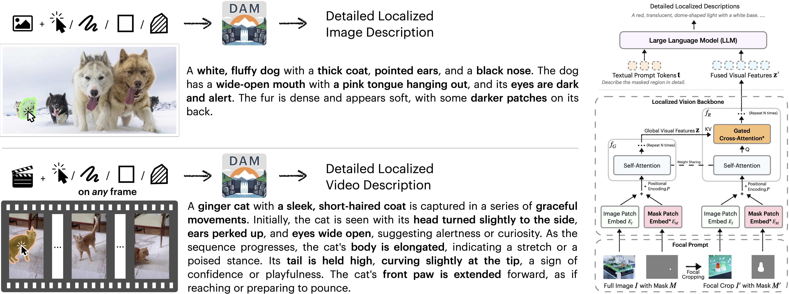
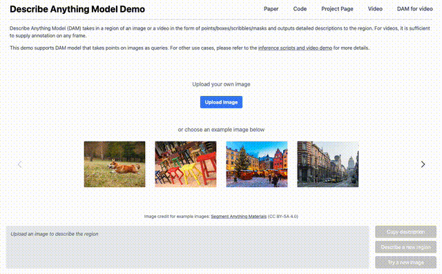

# Describe Anything

**NVIDIA, UC Berkeley, UCSF**

[Long Lian](https://tonylian.com), [Yifan Ding](https://research.nvidia.com/person/yifan-ding), [Yunhao Ge](https://gyhandy.github.io/), [Sifei Liu](https://sifeiliu.net/), [Hanzi Mao](https://hanzimao.me/), [Boyi Li](https://sites.google.com/site/boyilics/home), [Marco Pavone](https://research.nvidia.com/person/marco-pavone), [Ming-Yu Liu](https://mingyuliu.net/), [Trevor Darrell](https://people.eecs.berkeley.edu/~trevor/), [Adam Yala](https://www.adamyala.org/), [Yin Cui](https://ycui.me/)

[Paper](https://arxiv.org/abs/2504.16072) | [Project Page](https://describe-anything.github.io/) | [Video](https://describe-anything.github.io/#video) | [HuggingFace Demo](https://huggingface.co/spaces/nvidia/describe-anything-model-demo) | [Model/Benchmark/Datasets](https://huggingface.co/collections/nvidia/describe-anything-680825bb8f5e41ff0785834c) | [Citation](#citation)



**TL;DR**: Our Describe Anything Model (DAM) takes in a region of an image or a video in the form of points/boxes/scribbles/masks and outputs detailed descriptions to the region. For videos, it is sufficient to supply annotation on any frame. We also release a new benchmark, DLC-Bench, to evaluate models on the DLC task.

# Running Describe Anything Model

## Installation

Install the `dam` package:

```sh
# You can install it without cloning the repo
pip install git+https://github.com/NVlabs/describe-anything

# You can also clone the repo and install it locally
git clone https://github.com/NVlabs/describe-anything
cd describe-anything
pip install -v .
```

We also provide a self-contained script for detailed localized image descriptions without installing additional dependencies. Please refer to the [examples/dam_with_sam_self_contained.py](examples/dam_with_sam_self_contained.py) for more details.

## Interactive Demo

### Full Huggingface Demo (this demo is also [hosted on Huggingface Spaces](https://huggingface.co/spaces/nvidia/describe-anything-model-demo))

<!-- [](assets/demo.mov) -->

<https://github.com/user-attachments/assets/468a5463-728a-4b0d-ba45-63dd5786b929>

To run the demo, run the following command:

```sh
cd demo
python app.py
```

### Simple Gradio Demo for Detailed Localized Image Descriptions

[`demo_simple.py`](demo_simple.py) - Interactive Gradio web interface for drawing masks on images and getting descriptions, with optional SAM integration for automated mask generation. **This demo is tested with `gradio` 5.5.0.**


### Simple Gradio Demo for Detailed Localized Video Descriptions

[`demo_video.py`](demo_video.py) - Interactive Gradio web interface for drawing masks on videos and getting descriptions, with SAM 2 integration for automated mask generation. **This demo is tested with `gradio` 5.5.0.**


## Examples
### Detailed Localized Image Descriptions
* [`examples/dam_with_sam.py`](examples/dam_with_sam.py) - Command-line tool for processing single images using SAM v1, allowing users to specify points or bounding boxes for mask generation

<details>
<summary>Expand to see example commands</summary>


```sh
# You can use it with points or a bounding box for the region of interest.
# SAM is used to turn points or a bounding box into a mask.
# You can also use mask directly, see `examples/query_dam_server.py`.
python examples/dam_with_sam.py --image_path images/1.jpg --points '[[1172, 812], [1572, 800]]' --output_image_path output_visualization.png
python examples/dam_with_sam.py --image_path images/1.jpg --box '[800, 500, 1800, 1000]' --use_box --output_image_path output_visualization.png
```

```
A medium-sized dog with a thick, reddish-brown coat and white markings on its face, chest, and paws. The dog has pointed ears, a bushy tail, and is wearing a red collar. Its mouth is open, showing its tongue and teeth, and it appears to be in mid-leap.
```

</details>

### Detailed Localized Image Descriptions without Installing Additional Dependencies

* [`examples/dam_with_sam_self_contained.py`](examples/dam_with_sam_self_contained.py) - Self-contained script for processing single images using SAM v1, allowing users to specify points or bounding boxes for mask generation without cloning the `dam` package.

<details>
<summary>Expand to see example commands</summary>

```sh
python examples/dam_with_sam_self_contained.py --image_path images/1.jpg --points '[[1172, 812], [1572, 800]]' --output_image_path output_visualization.png
```
</details>


### Detailed Localized Video Descriptions
* [`examples/dam_video_with_sam2.py`](examples/dam_video_with_sam2.py) - Video processing script using SAM v2.1 that only requires first-frame localization and automatically propagates masks through the video

<details>
<summary>Expand to see example commands</summary>


```sh
# You can use it with points or a bounding box for the region of interest. Annotation on one frame is sufficient.
# You can also use mask directly, see `examples/query_dam_server_video.py`.
python examples/dam_video_with_sam2.py --video_dir videos/1 --points '[[1824, 397]]' --output_image_dir videos/1_visualization
python examples/dam_video_with_sam2.py --video_dir videos/1 --box '[1612, 364, 1920, 430]' --use_box --output_image_dir videos/1_visualization

# You can also use video file directly.
python examples/dam_video_with_sam2.py --video_file videos/1.mp4 --points '[[1824, 397]]' --output_image_dir videos/1_visualization
```

```
A sleek, silver SUV is prominently featured, showcasing a modern and aerodynamic design. The vehicle's smooth, metallic surface reflects light, highlighting its well-defined contours and sharp lines. The front of the SUV is characterized by a bold grille and sharp headlights, giving it a dynamic and assertive appearance. As the sequence progresses, the SUV moves steadily forward, its wheels turning smoothly on the road. The side profile reveals tinted windows and a streamlined body, emphasizing its spacious interior and robust build. The rear of the SUV is equipped with stylish taillights and a subtle spoiler, adding to its sporty aesthetic. Throughout the sequence, the SUV maintains a consistent speed, suggesting a confident and controlled drive, seamlessly integrating into the flow of traffic.
```

</details>

## OpenAI-compatible API

* [`dam_server.py`](dam_server.py) - Core server implementation providing an OpenAI-compatible API endpoint for the Describe Anything Model (DAM), handling both image and video inputs with streaming support. We use the alpha channel for image/video mask for the region of interest.

<details>
<summary>Expand to see example commands</summary>

```sh
# Image-only DAM
python dam_server.py --model-path nvidia/DAM-3B --conv-mode v1 --prompt-mode focal_prompt --temperature 0.2 --top_p 0.9 --num_beams 1 --max_new_tokens 512 --workers 1

# Image-video joint DAM
python dam_server.py --model-path nvidia/DAM-3B-Video --conv-mode v1 --prompt-mode focal_prompt --temperature 0.2 --top_p 0.9 --num_beams 1 --max_new_tokens 512 --workers 1 --image_video_joint_checkpoint
```

</details>

### Examples for DAM Server with OpenAI-compatible API

* [`examples/query_dam_server.py`](examples/query_dam_server.py) - Client example using OpenAI's SDK to interact with the DAM server for single image processing

<details>
<summary>Expand to see example commands</summary>

```sh
python examples/query_dam_server.py --model describe_anything_model --server_url http://localhost:8000
```

</details>

* [`examples/query_dam_server_raw.py`](examples/query_dam_server_raw.py) - Client example showing how to make direct HTTP requests to the DAM server without using the OpenAI SDK

<details>
<summary>Expand to see example commands</summary>

```sh
python examples/query_dam_server_raw.py --model describe_anything_model --server_url http://localhost:8000
```

</details>

* [`examples/query_dam_server_video.py`](examples/query_dam_server_video.py) - Client example demonstrating how to process videos through the DAM server using the OpenAI SDK, handling multiple frames in a single request

<details>
<summary>Expand to see example commands</summary>
Note that please use the joint checkpoint trained on both images and videos for video processing.

```sh
python examples/query_dam_server_video.py --model describe_anything_model --server_url http://localhost:8000
```

</details>

# Evaluating your model on DLC-Bench

We provide a script to evaluate your model on DLC-Bench. Please refer to the [evaluation README](evaluation/README.md) for more details.

## Citation

If you use our work or our implementation in this repo, or find them helpful, please consider giving a citation.

```
@article{lian2025describe,
  title={Describe Anything: Detailed Localized Image and Video Captioning}, 
  author={Long Lian and Yifan Ding and Yunhao Ge and Sifei Liu and Hanzi Mao and Boyi Li and Marco Pavone and Ming-Yu Liu and Trevor Darrell and Adam Yala and Yin Cui},
  journal={arXiv preprint arXiv:2504.16072},
  year={2025}
}
```

# Acknowledgements

We would like to thank the following projects for their contributions to this work:

- [LLaVA](https://github.com/haotian-liu/LLaVA)
- [VILA](https://github.com/NVlabs/VILA)
- [SAM](https://github.com/facebookresearch/segment-anything)
- [SAM2](https://github.com/facebookresearch/sam2)
- [OpenAI Library](https://github.com/openai/openai-python)
